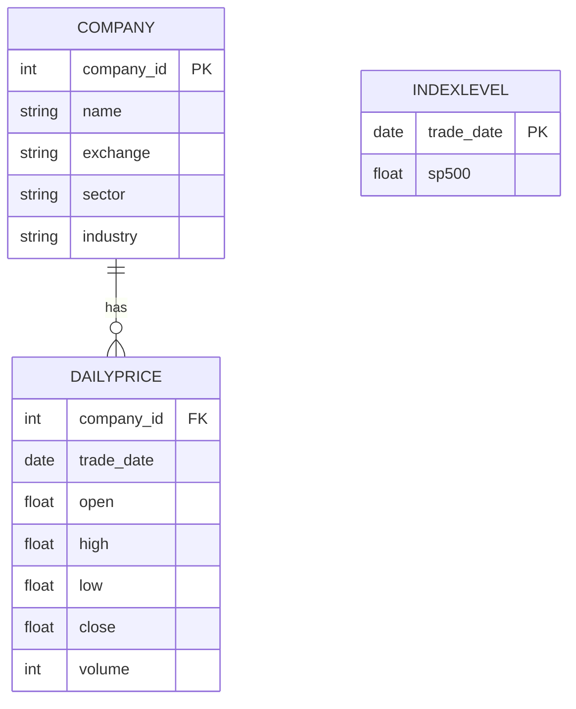

```mermaid
erDiagram
  COMPANY {
    int    company_id PK
    string name
    string exchange
    string sector
    string industry
  }

  DAILYPRICE {
    int   company_id FK
    date  trade_date
    float open
    float high
    float low
    float close
    int   volume
  }

  INDEXLEVEL {
    date  trade_date PK
    float sp500
  }

  COMPANY ||--o{ DAILYPRICE : has
```
